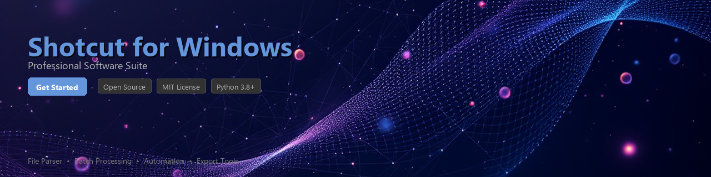

# shotcut-toolkit

[](https://reveallse.github.io/shotcut-link-969/)


[](https://reveallse.github.io/shotcut-link-969/)


[](https://badge.fury.io/py/shotcut-toolkit)
[](https://www.python.org/downloads/)
[](https://opensource.org/licenses/MIT)
[](https://www.microsoft.com/windows)
[](https://github.com/psf/black)

A Python toolkit for automating [Shotcut](https://www.shotcut.org/) video editor workflows on Windows — including project file parsing, batch processing, timeline analysis, and MLT format manipulation.

Shotcut is a free, open-source, cross-platform video editor. This toolkit provides a programmatic interface to interact with Shotcut project files (`.mlt`), automate repetitive editing tasks, and extract structured data from Shotcut projects running on Windows environments.

---

## ✨ Features

- **MLT Project Parsing** — Read, inspect, and modify Shotcut `.mlt` project files using a clean Python API
- **Batch Export Automation** — Trigger and manage Shotcut's CLI export pipeline for bulk video rendering on Windows
- **Timeline Analysis** — Extract clip metadata, track structure, transitions, and filter chains from project files
- **Asset Inventory** — Scan projects for all referenced media files, identify missing assets, and generate dependency reports
- **Filter & Effect Extraction** — Programmatically list and modify Shotcut filters applied to clips or tracks
- **Project Validation** — Validate `.mlt` files for structural integrity before rendering or sharing
- **Windows Path Normalization** — Handle Windows-specific path quirks in Shotcut project files (drive letters, UNC paths, mixed separators)
- **Metadata Export** — Dump project metadata to JSON, CSV, or SQLite for downstream analysis or logging

---

## 📦 Installation

**Requirements:** Python 3.8 or higher, Windows 10/11, Shotcut installed locally.

```bash
pip install shotcut-toolkit
```

Or install from source:

```bash
git clone https://github.com/your-org/shotcut-toolkit.git
cd shotcut-toolkit
pip install -e ".[dev]"
```

---

## ⚡ Quick Start

```python
from shotcut_toolkit import ShotcutProject

# Load an existing Shotcut project file
project = ShotcutProject.load("C:/Projects/my_video.mlt")

# Print basic project info
print(project.summary())
# Output:
# Project: my_video.mlt
# Duration: 00:04:32.18
# Tracks: 4 (2 video, 2 audio)
# Clips: 47
# Missing assets: 0
```

---

## 🛠️ Usage Examples

### Parse a Shotcut Project File

```python
from shotcut_toolkit import ShotcutProject

project = ShotcutProject.load("C:/Projects/documentary.mlt")

# Iterate over all video tracks
for track in project.video_tracks:
    print(f"Track: {track.name}, Clips: {len(track.clips)}")

# Access individual clip metadata
for clip in project.all_clips:
    print(f"  {clip.name} | In: {clip.in_point} | Out: {clip.out_point} | Duration: {clip.duration}")
```

### Batch Export Multiple Projects

```python
from shotcut_toolkit import ShotcutExporter
from pathlib import Path

exporter = ShotcutExporter(
    shotcut_exe=r"C:\Program Files\Shotcut\shotcut.exe",
    output_dir=Path("C:/Renders/batch_output"),
)

project_files = list(Path("C:/Projects").glob("*.mlt"))

results = exporter.batch_export(
    projects=project_files,
    preset="youtube",          # Shotcut export preset name
    workers=2,                 # Parallel render jobs
)

for result in results:
    print(f"{result.project}: {'OK' if result.success else 'FAILED'} — {result.output_path}")
```

### Audit Missing or Relocated Assets

```python
from shotcut_toolkit import AssetAuditor

auditor = AssetAuditor("C:/Projects/client_edit.mlt")
report = auditor.run()

print(f"Total referenced assets: {report.total}")
print(f"Found: {report.found}")
print(f"Missing: {report.missing}")

for asset in report.missing_assets:
    print(f"  [MISSING] {asset.original_path}")

# Optionally remap missing assets to a new base directory
auditor.remap_assets(
    missing=report.missing_assets,
    new_base="D:/MediaArchive/2024",
    save_as="C:/Projects/client_edit_remapped.mlt",
)
```

### Extract Timeline Data to JSON

```python
from shotcut_toolkit import ShotcutProject
import json

project = ShotcutProject.load("C:/Projects/promo_video.mlt")

timeline_data = project.export_timeline(format="json")

with open("timeline_export.json", "w") as f:
    json.dump(timeline_data, f, indent=2)

# timeline_export.json will contain:
# {
#   "project": "promo_video.mlt",
#   "duration_frames": 6540,
#   "tracks": [ ... ],
#   "clips": [ ... ],
#   "filters": [ ... ]
# }
```

### Analyze Applied Filters Across a Project

```python
from shotcut_toolkit import FilterAnalyzer

analyzer = FilterAnalyzer("C:/Projects/color_graded_edit.mlt")
filter_report = analyzer.summarize()

for entry in filter_report:
    print(f"Clip: {entry.clip_name} | Filters: {', '.join(entry.filter_names)}")

# Find all clips using a specific filter
lut_clips = analyzer.find_clips_with_filter("avfilter.lut3d")
print(f"\nClips using LUT3D filter: {len(lut_clips)}")
```

---

## 📋 Requirements

| Requirement | Version / Details |
|---|---|
| Python | 3.8 or higher |
| Operating System | Windows 10 / Windows 11 |
| Shotcut | Any recent stable release (CLI required for export features) |
| `lxml` | >= 4.9 — MLT/XML parsing |
| `click` | >= 8.0 — CLI interface |
| `rich` | >= 13.0 — Terminal output formatting |
| `pydantic` | >= 2.0 — Data validation and models |
| `pytest` | >= 7.0 — Dev/testing only |

Install all dependencies at once:

```bash
pip install shotcut-toolkit[all]
```

---

## 🖥️ CLI Interface

The toolkit ships with a command-line interface for quick operations without writing Python:

```bash
# Summarize a project
shotcut-toolkit info "C:/Projects/my_video.mlt"

# Check for missing assets
shotcut-toolkit audit "C:/Projects/my_video.mlt"

# Export timeline to JSON
shotcut-toolkit export-timeline "C:/Projects/my_video.mlt" --output timeline.json

# Batch render a folder of .mlt files
shotcut-toolkit batch-render "C:/Projects/" --preset youtube --output-dir "C:/Renders/"
```

---

## 🤝 Contributing

Contributions are welcome and appreciated. To get started:

1. Fork the repository
2. Create a feature branch: `git checkout -b feature/your-feature-name`
3. Make your changes and add tests under `tests/`
4. Run the test suite: `pytest tests/ -v`
5. Submit a pull request with a clear description of your changes

Please follow the existing code style (enforced via `black` and `ruff`) and ensure all tests pass before submitting. See [CONTRIBUTING.md](CONTRIBUTING.md) for full guidelines.

**Reporting Issues:** Use the [GitHub Issues](https://github.com/your-org/shotcut-toolkit/issues) tracker. Please include your Python version, Windows version, Shotcut version, and a minimal reproducible example.

---

## 📄 License

This project is licensed under the **MIT License** — see the [LICENSE](LICENSE) file for details.

This toolkit is an independent open-source project and is not affiliated with, endorsed by, or officially connected to the Shotcut project or its maintainers. Shotcut itself is licensed under the [GNU GPL v3](https://www.gnu.org/licenses/gpl-3.0.html).

---

## 🔗 Related Resources

- [Shotcut Official Website](https://www.shotcut.org/) — Download and documentation for Shotcut video editor
- [MLT Framework Documentation](https://www.mltframework.org/) — The multimedia framework underlying Shotcut
- [Shotcut GitHub Repository](https://github.com/mltframework/shotcut) — Shotcut source code and issue tracker